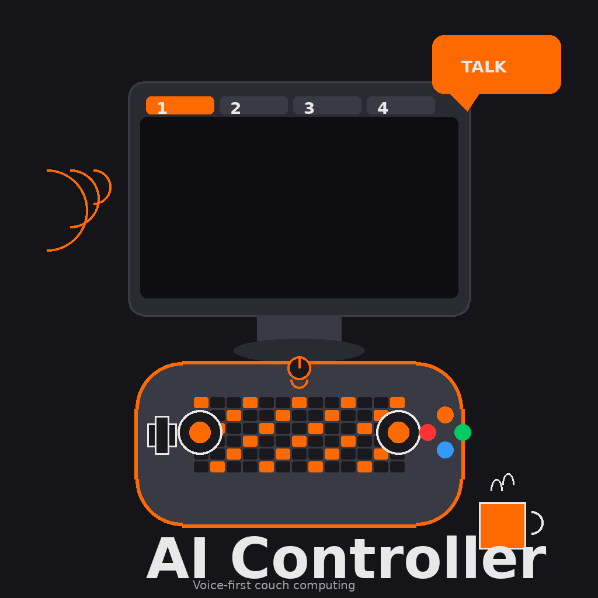

🎮 **AI Controller** — Couch Computing, Voice-First
================================================================



[](LICENSE)
[]()
[]()
[]()

**Talk to your computer from the couch. No keyboard. No mouse. Just a controller and headphones.**

Plug in any corded or Bluetooth controller — Xbox, PlayStation, DualShock, generic USB — put on a headset, and run your entire desktop by voice. Press a trigger to talk. A floating keyboard and controller legend keep you in control without getting up.

> 🗂️ **Repository map** — this repo is the private software source. There are three related repos:
> - `ebey317/ai-controller` — public landing page (README + LICENSE only)
> - `ebey317/-AI-controller.` — this repo: the actual source code and install scripts
> - `ebey317/ai-controller-profile` — controller profiles, systemd units, and reference docs

---

## How It Works

```
┌─────────────────────────────────────────────────────────────┐
│  Xbox/PlayStation Controller                                │
│  ┌─────────┐    ┌─────────┐    ┌─────────┐    ┌─────────┐  │
│  │   RT    │    │  View   │    │   LS    │    │   RS    │  │
│  │  Talk   │    │Keyboard │    │ Escape  │    │  Enter  │  │
│  └─────────┘    └─────────┘    └─────────┘    └─────────┘  │
└─────────────────────────────────────────────────────────────┘
         │              │              │              │
         ▼              ▼              ▼              ▼
┌─────────────────────────────────────────────────────────────┐
│  AntiMicroX → F13 → ptt_pynput.py → Whisper → Text Output  │
└─────────────────────────────────────────────────────────────┘
         │
         ▼
┌─────────────────────────────────────────────────────────────┐
│  Dictation Modes: PRO | BUBBLY | CASUAL | BOLD | BIG       │
└─────────────────────────────────────────────────────────────┘
```

---

## Base Product — $30

The base AI Controller lets you talk **to** your computer:

- 🎤 **Microphone push-to-talk** — press Right Trigger, speak, release
- 🌐 **Dynamic output** — your speech becomes plain typed text in the active app
- ⌨️ **Floating on-screen keyboard** — toggle it with the View button, type with the stick
- 🕹️ **Floating controller legend** — see your button mappings as an overlay
- 🔌 **Universal controller support** — Xbox, PlayStation, DualShock, USB, Bluetooth
- ⚙️ **Power-loss safe** — systemd services restart everything on boot

**At $30, the computer listens and types. It does not talk back.**

---

## Level-Ups (Sold Separately) — New Identities

Each level-up gives the AI Controller a new identity.

### Level-Up 1: Voice Identity
The computer talks back to you.

- 🔊 **Voice response** — the AI reads answers aloud through your headphones
- 🎙️ **Voice packs** — Joe included; premium Piper voices unlock from the shelf

### Level-Up 2: Dictation Identity
Your speech gets styled before it is typed.

- ✨ **Output modes** — PRO, BUBBLY, CASUAL, BOLD, BIG text personality transforms

### Power Level-Up: Full Identity
Bundle one voice with one dictation mode. The agent sounds different **and** your words look different. That's a complete identity swap.

---

## 🚀 Quick Start

```bash
git clone https://github.com/ebey317/-AI-controller..git
cd '-AI-controller.'
bash install.sh
```

**Supported Platforms:**
- 🐧 **Linux** — Ubuntu, Mint, Debian (apt)
- 🍎 **macOS** — Homebrew required
- 🪟 **Windows** — WSL2 recommended

1. Plug in your controller (corded or Bluetooth)
2. Put on headphones
3. Press **Right Trigger** and talk
4. Press **View** to toggle the keyboard

---

## Related Repositories

| Repo | Purpose | URL |
|---|---|---|
| `ebey317/ai-controller` | Public landing page (README + LICENSE) | https://github.com/ebey317/ai-controller |
| `ebey317/-AI-controller.` | **This source repo** — install scripts, launcher, voice bridge | https://github.com/ebey317/-AI-controller. |
| `ebey317/ai-controller-profile` | AntiMicroX profiles, systemd units, reference docs | https://github.com/ebey317/ai-controller-profile |

---

## Pricing

- **$30** — Base AI Controller (talk to your PC, plain text output)
- **Voice level-up** — sold separately
- **Dictation level-up** — sold separately
- **Power level-up** — voice + dictation bundle (save vs. buying separately)
- **MIT licensed** — use it, modify it, resell your own builds

---

## Support

- Voice packs: `voices/README.md`
- Releases & updates: `RELEASES.md`
- Issues: https://github.com/ebey317/-AI-controller./issues
